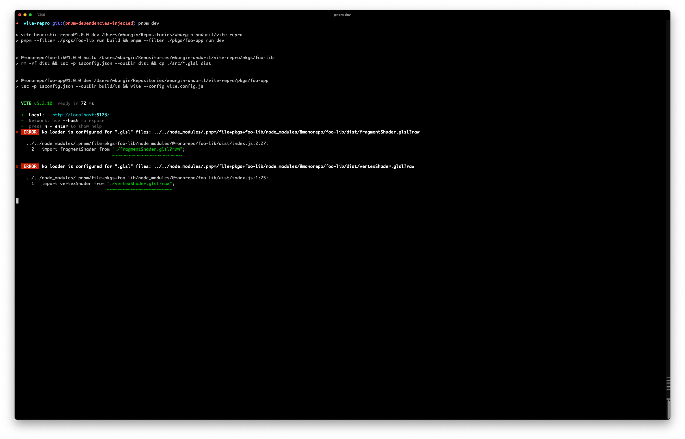

# vite-heuristic-repro

Demonstrate an issue with the heuristic that Vite uses to differentiate between in-repo code and NPM packages.

## Repro

On the `master` branch:
+ Run `pnpm build`
+ Open `bazel-bin/pkgs/foo-app/foo-app/dist/index.html` and observe that the page works
  
+ Run `pnpm dev` and observe the errors in the console
  

On the `patched` branch:
+ Run `pnpm dev` and observe that there are no errors in the console and that the page works again
+ Check out `patches/vite@5.2.10.patch` to see how Vite was patched on this branch

On the `pnpm-dependencies-injected` branch:
+ Run `pnpm` to intall dependencies
+ Run `pnpm dev` and observe the errors in the console
  
+ Take a look at how PNPM links `@monorepo/foo-lib` into `@monorepo/foo-app` in this configuration:
  ```
  ➜  vite-repro ✗ pushd pkgs/foo-app  
  ➜  foo-app ✗ node -e 'console.log(require.resolve("@monorepo/foo-lib"))'
  /Users/wburgin/Repositories/wburgin-anduril/vite-repro/node_modules/.pnpm/file+pkgs+foo-lib/node_modules/@monorepo/foo-lib/dist/index.js
  ```
