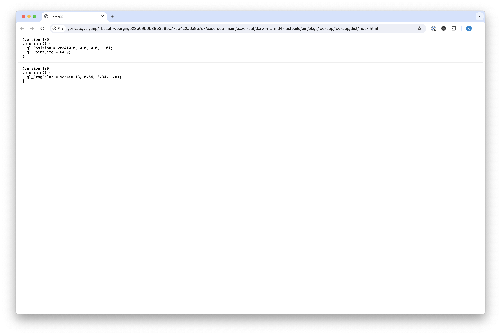
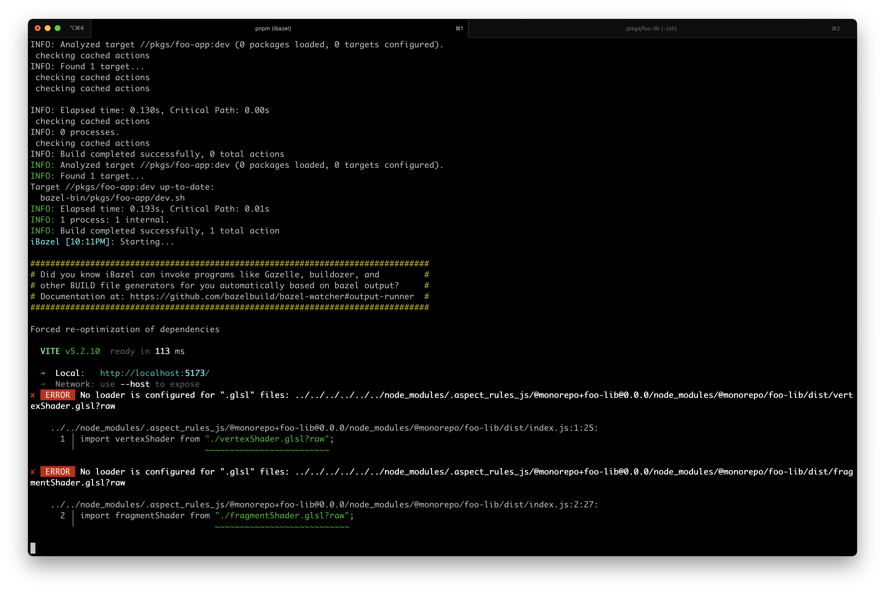

# vite-heuristic-repro

Demonstrate an issue with the heuristic that Vite uses to differentiate between in-repo code and NPM packages.

## Repro

On the `master` branch:
+ Run `pnpm build`
+ Open `bazel-bin/pkgs/foo-app/foo-app/dist/index.html` and observe that the page works
  
+ Run `pnpm dev` and observe the errors in the console
  

On the `patched` branch:
+ Run `pnpm dev` and observe that there are no errors in the console and that the page works
+ Open `patches/vite@5.2.10.patch` to see how Vite was patched on this branch
